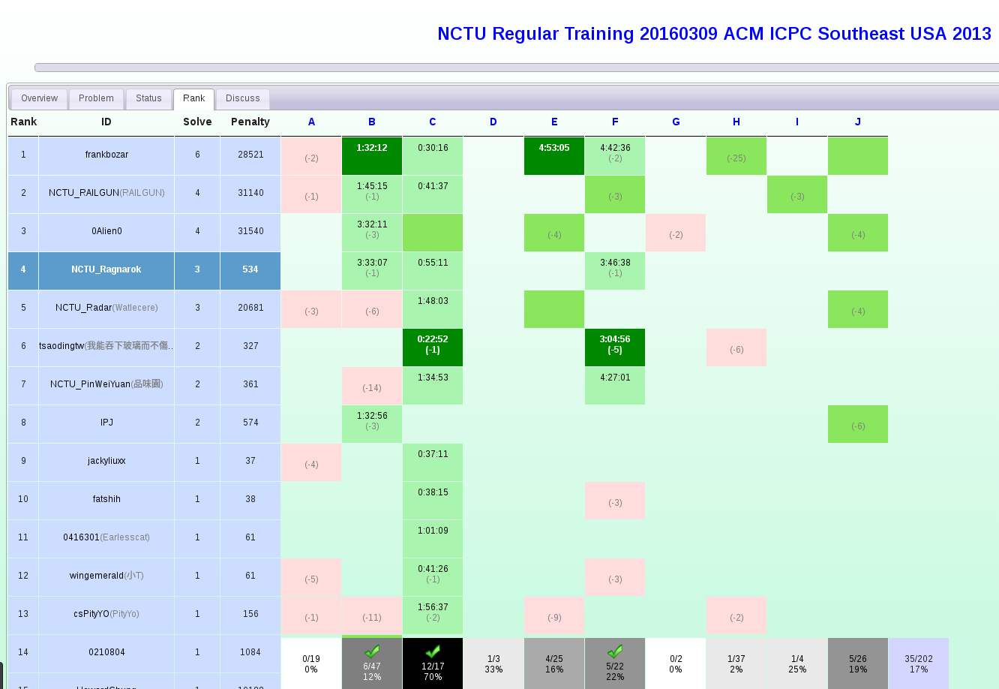

#[NCTU Regular Training 20160309 ACM ICPC Southeast USA 2013](http://acm.hust.edu.cn/vjudge/contest/view.action?cid=108058#rank)

This is a practice from [vjudge](http://acm.hust.edu.cn/vjudge/toIndex.action) of [ACM ICPC Southeast USA 2013](http://acm.hust.edu.cn/vjudge/contest/view.action?cid=108058#rank)

##Standing
####Finished:
[Problem B](code/pB.cpp)

[Problem C](code/pC.cpp)

[Problem F](code/pF.cpp)

####Trying:
Problem A

Problem D

Problem E

Problem G

Problem H

Problem I

Problem J

##Record:

|   Milestone   |  A  |  B  |  C  |  D  |  E  |  F  |  G  |  H  |  I  |  J  |  K  |  L  |
| :-----------: |:---:|:---:|:---:|:---:|:---:|:---:|:---:|:---:|:---:|:---:|:---:|:---:|
|    Panalty    |     |03:33|00:55|     |     |03:46|     |     |     |     |     |     |
|               |     | -1  |     |     |     | -1  |     |     |     |     |     |     |
| Begin Reading |     |     |     |     |     |     |     |     |     |     |     |     |
|  End Reading  |     |     |     |     |     |     |     |     |     |     |     |     |
|   1st Begin   |     |     |     |     |     |     |     |     |     |     |     |     |
|    1st End    |     |03:05|00:55|     |     |03:38|     |     |     |     |     |     |
|  1st  Result  |     | WA  | AC  |     |     | TLE |     |     |     |     |     |     |
|   2nd Begin   |     |     |     |     |     |     |     |     |     |     |     |     |
|    2nd End    |     |03:33|     |     |     |03:46|     |     |     |     |     |     |
|  2nd  Result  |     | AC  |     |     |     | AC  |     |     |     |     |     |     |

##Submission:

