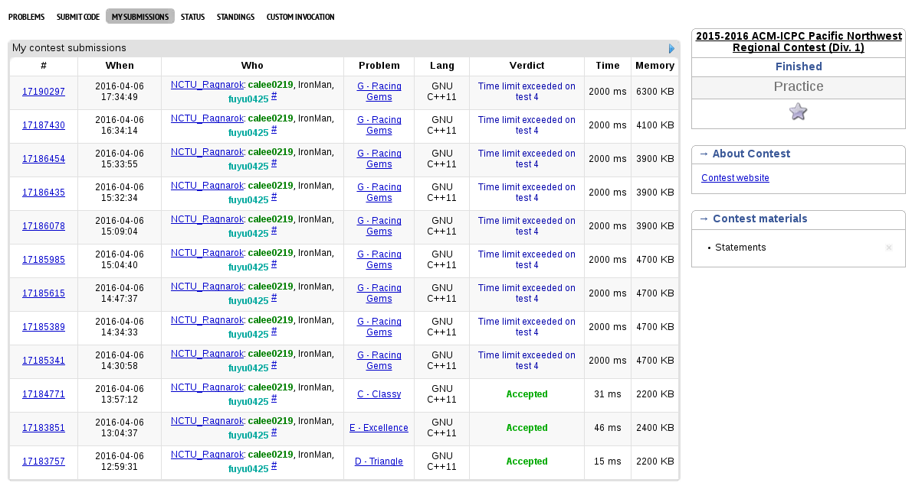

#2015 ACM-ICPC Pacific Northwest Regional Contest (Div. 1)

This is a demo from Codeforces Gym of [2015 ACM-ICPC Pacific Northwest Regional Contest (Div. 1)](http://www.codeforces.com/gymRegistration/100820/virtual/true)

##[Problem set](Doc/20152016-acmicpc-pacific-northwest-regional-contest-div-1-en.pdf)

##Standing
####Finished:
[Problem C](C-Classy.cpp)

[Problem D](E-Excellence.cpp)

[Problem E](D-Triangle.cpp)

####Haven't finished:
Problem G

####Trying:
Problem K

##Record:

##MySubmission:

