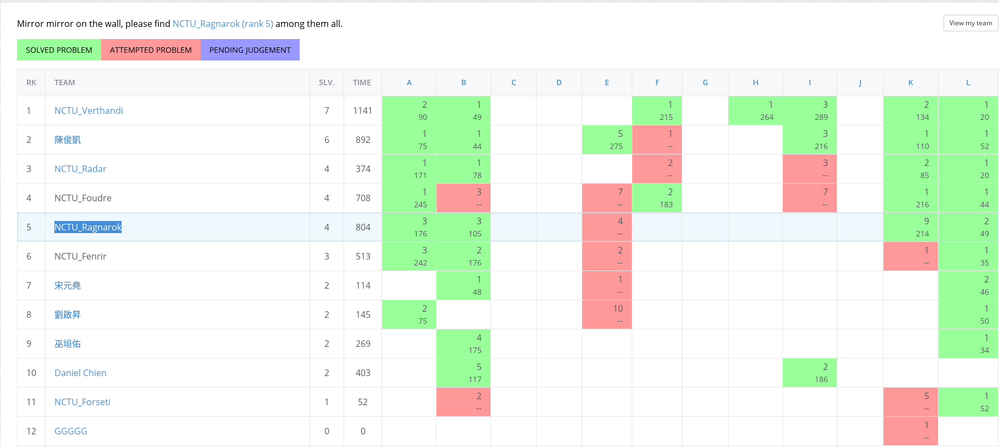

#[NCTU Regular Practice 20160420 (Clone NAIPC Practice 2016-02-27)](https://open.kattis.com/contests/jmdk25)

This is a practice from [Kattis Problem Archive](https://open.kattis.com/) of [NCTU Regular Practice 20160420 (Clone NAIPC Practice 2016-02-27)](https://open.kattis.com/contests/jmdk25)

##Standing
####Finished:
[Problem A](code/pA.cpp)

[Problem B](code/pB.cpp)

[Problem K](code/pK.cpp)

[Problem L](code/pL.cpp)

####After constest:
[Problem C](code/pC.cpp)

[Problem E](code/pE.cpp)

####Trying:
Problem D

Problem F

Problem G

Problem H

Problem I

Problem J

##Record:

|   Milestone   |  A  |  B  |  C  |  D  |  E  |  F  |  G  |  H  |  I  |  J  |  K  |  L  |
| :-----------: |:---:|:---:|:---:|:---:|:---:|:---:|:---:|:---:|:---:|:---:|:---:|:---:|
|    Panalty    |02:57|01:42|     |     |     |     |     |     |     |     |03:35|00:49|
|               | -2  | -2  |     |     | -1  |     |     |     |     |     | -8  |  1  |
| Begin Reading |00:00|00:00|00:03|00:17|00:17|00:36|00:36|00:47|     |     |00:50|00:23|
|  End Reading  |00:15|00:16|00:16|00:22|00:23|00:41|     |01:02|     |     |01:06|00:29|
|   1st Begin   |02:05|00:16|     |     |02:31|     |     |     |     |     |02:02|00:29|
|    1st End    |     |00:20|     |     |03:10|     |     |     |     |     |02:20|00:37|
|  1st  Result  | WA  | WA  |     |     | WA  |     |     |     |     |     | WA  | WA  |
|   2nd Begin   |02:20|01:28|     |     |     |     |     |     |     |     |02:20|00:40|
|    2nd End    |     |01:32|     |     |     |     |     |     |     |     |02:35|00:49|
|  2nd  Result  | WA  | WA  |     |     |     |     |     |     |     |     | WA  | AC  |
|   3rd Begin   |     |01:40|     |     |     |     |     |     |     |     |     |     |
|    3rd End    |02:57|01:42|     |     |     |     |     |     |     |     |02:49|     |
|  3rd  Result  | AC  | AC  |     |     |     |     |     |     |     |     | WA  |     |
|   4th Begin   |     |     |     |     |     |     |     |     |     |     |     |     |
|    4th End    |     |     |     |     |     |     |     |     |     |     |03:29|     |
|  4th  Result  |     |     |     |     |     |     |     |     |     |     | WA  |     |
|   5th Begin   |     |     |     |     |     |     |     |     |     |     |     |     |
|    5th End    |     |     |     |     |     |     |     |     |     |     |03:35|     |
|  5th  Result  |     |     |     |     |     |     |     |     |     |     | AC  |     |

##Submission:

